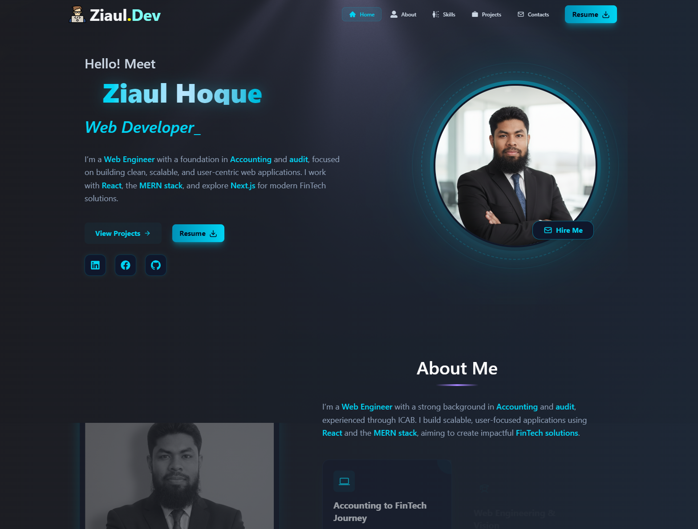

# Personal Protfolio# 🚀 Personal Portfolio Website

A modern and interactive personal portfolio website built with React and cutting-edge technologies. This website showcases my projects and allows clients to hire me as a MERN Stack Developer.

## ✨ Features

- 🎨 **Modern UI/UX Design** - Attractive and responsive design built with Tailwind CSS
- 🎭 **Smooth Animations** - Seamless animations with Framer Motion and Motion
- 🎬 **Interactive Elements** - Lottie animations and TypeWriter effects
- 📱 **Fully Responsive** - Perfect view on all devices
- 🎯 **Project Showcase** - Detailed display of all projects
- 📧 **Contact Section** - Direct contact facility
- 🌐 **3D Graphics** - Interactive 3D elements created with OGL
- ⚡ **Fast Performance** - Optimized and fast loading

## 🛠️ Technologies Used

### Frontend
- **React** - UI library
- **React Router DOM** - Navigation and routing
- **Tailwind CSS** - Utility-first CSS framework
- **Framer Motion** - Advanced animations
- **Motion** - Additional animation library

### UI/UX Enhancements
- **Lottie React** - High-quality animations
- **Lucide React** - Beautiful icons
- **React Simple Typewriter** - Typewriter text effects
- **React Hot Toast** - Toast notifications
- **OGL** - WebGL library for 3D graphics

## 📸 Screenshots

### Home Page


## 🌐 Live Demo

**Live Site:** [https://ziauldev.vercel.app/]

## 🚀 Installation & Setup

### Prerequisites
- npm or yarn

### Installation Steps

1. **Clone the repository**
```bash
git clone https://github.com/ziaul-hoque4820/ziaul.dev-portfolio.git
cd portfolio
```

2. **Install dependencies**
```bash
npm install
# or
yarn install
```

3. **Start the development server**
```bash
npm run dev
# or
yarn dev
```

4. **Build for production**
```bash
npm run build
# or
yarn build
```


## 🎯 Key Sections

- **Hero Section** - Attractive intro and CTA
- **About Me** - Detailed information about me and my skills
- **Projects** - Showcase of completed projects
- **Skills** - Technical skills and expertise
- **Contact** - Contact form for getting in touch

## 💼 Skills Highlighted

- **Frontend:** React, JavaScript, HTML5, CSS3, Tailwind CSS
- **Backend:** Node.js, Express.js
- **Database:** MongoDB
- **Full Stack:** MERN Stack Development
- **Tools:** Git, GitHub, VS Code
- **Design:** Responsive Design, UI/UX

## 📫 Contact

If you're looking for a MERN Stack Developer or want to collaborate on any project, feel free to reach out:

- **Email:** [ziaul.dev@gmail.com]
- **LinkedIn:** [https://www.linkedin.com/in/ziaul-hoque-patwary-a0a546324/]
- **GitHub:** [https://github.com/ziaul-hoque4820]

## 🤝 Hire Me

I'm an experienced **MERN Stack Developer** offering the following services:

- ✅ Full Stack Web Application Development
- ✅ Custom Web Solutions
- ✅ API Development & Integration
- ✅ Database Design & Management
- ✅ Responsive UI/UX Implementation
- ✅ Performance Optimization
- ✅ Bug Fixes & Maintenance

**Ready to work together!** 💼


## 🙏 Acknowledgments

- Framer Motion for amazing animations
- Tailwind CSS for utility-first styling
- Lottie Files for beautiful animations
- All the open-source contributors

---

⭐ If you like this project, don't forget to give it a star!

**Made with ❤️ by [Ziaul.Dev]**